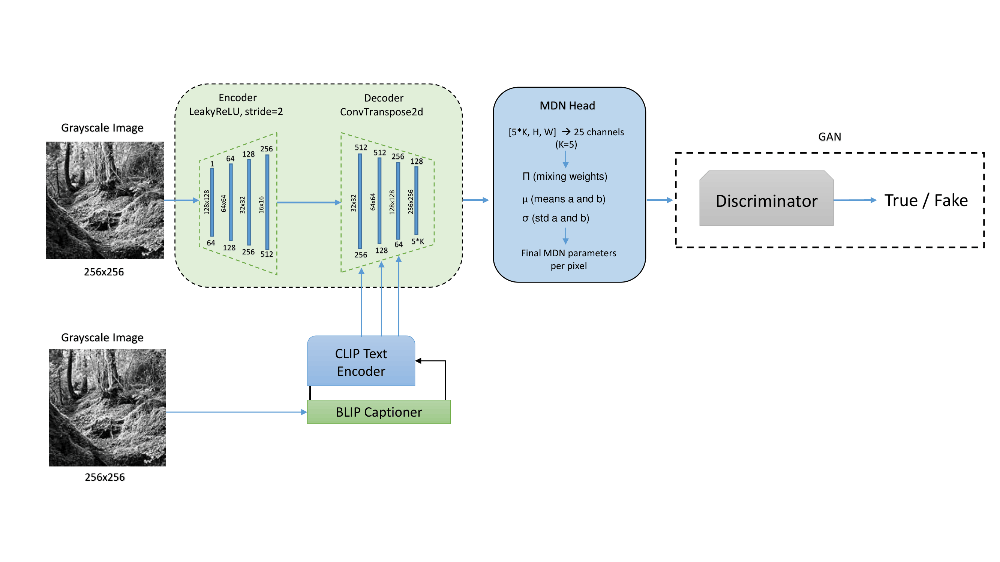
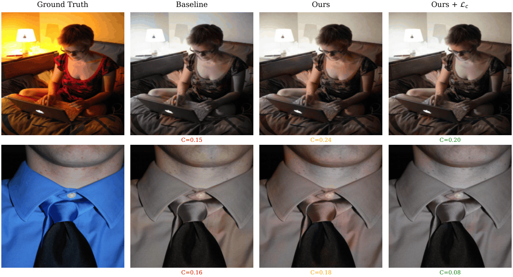
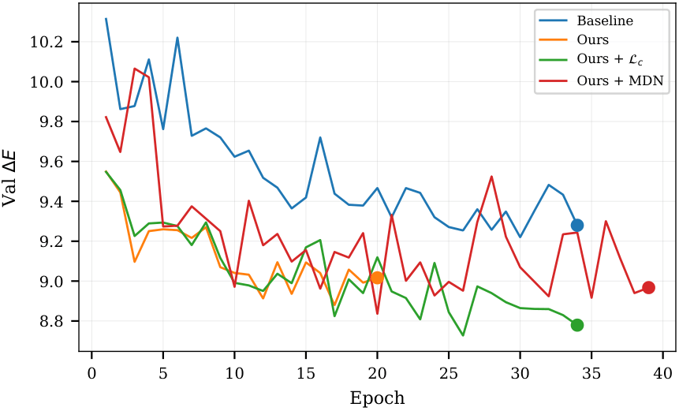
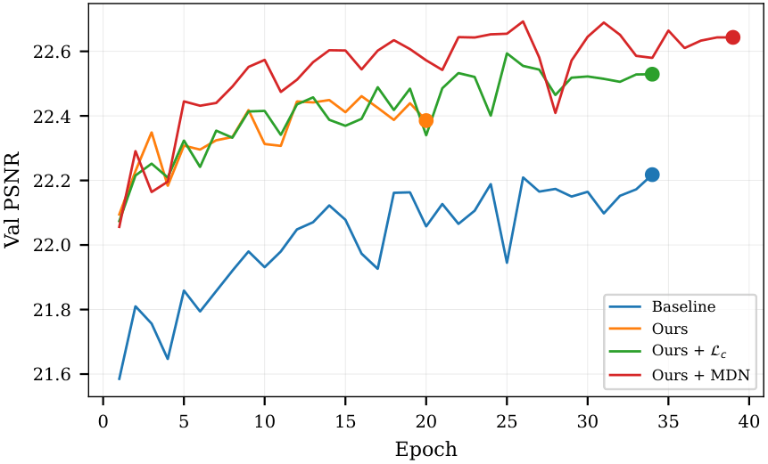

# Text-Guided Probablistic Image Colorization with Cross-Attention and Mixture Density Networks

Automatic colorization of grayscale photographs using **caption-derived semantic
guidance**. A U-Net regresses chrominance (`ab` in CIE Lab) from luminance (`L`),
conditioned on CLIP token embeddings of BLIP-generated captions through
**multi-head cross-attention** and **FiLM modulation**. Two decoding heads are
explored: deterministic regression and a **K=5 Mixture Density Network** that
captures the multi-modal distribution over plausible colorizations.

The repository contains the full training pipeline, evaluation scripts, and result visuals.

<p align="center">
  
</p>

> *Figure 1.* Text-conditioned U-Net architecture. The L-channel encoder/decoder
> (top) is augmented at three decoder scales by a `TextConditionedBlock`
> consuming 512-d CLIP token embeddings (bottom path).

---

## Table of Contents

- [Text-Guided Probablistic Image Colorization with Cross-Attention and Mixture Density Networks](#text-guided-probablistic-image-colorization-with-cross-attention-and-mixture-density-networks)
  - [Table of Contents](#table-of-contents)
  - [Motivation](#motivation)
  - [Method](#method)
    - [Pipeline](#pipeline)
    - [Key Components](#key-components)
    - [Loss](#loss)
  - [Repository Layout](#repository-layout)
  - [Quick Start](#quick-start)
    - [Local](#local)
    - [Google Colab](#google-colab)
    - [Smoke test](#smoke-test)
  - [Reproducing the Results](#reproducing-the-results)
  - [Configuration](#configuration)
    - [Hyperparameters](#hyperparameters)
  - [Results](#results)
    - [Main Ablation (Test Set)](#main-ablation-test-set)
    - [Chroma Recovery](#chroma-recovery)
    - [Training Dynamics](#training-dynamics)
  - [Per-Category Analysis](#per-category-analysis)
  - [MDN Decoding Strategies](#mdn-decoding-strategies)
  - [Evaluation Metrics](#evaluation-metrics)
  - [Files Produced by Training](#files-produced-by-training)
  - [Acknowledgments](#acknowledgments)

---

## Motivation

Colorization is fundamentally **ambiguous**: a grayscale "car" could be red,
blue, or silver, and a regression-only objective collapses to the mean — the
washed-out, brownish output common in single-objective baselines. The two
contributions of this work attack that ambiguity from opposite directions:

1. **Semantic disambiguation through text.** A caption identifying *what* is in
   the scene (sky, grass, animal type) shifts the likely color distribution
   sharply. We extract object/scene nouns from a BLIP caption, embed them with
   CLIP, and inject token-level information at multiple spatial scales of the
   decoder.
2. **Probabilistic outputs through MDN.** Instead of forcing a single point
   prediction, the model emits the parameters of a 5-component Gaussian mixture
   per pixel, allowing **diverse plausible colorizations** by sampling and
   recovering chroma that L1 regression suppresses.

Additionally, a **chroma-aware loss** (`L_chroma = ‖|C_pred| − |C_gt|‖₁` where
`C = √(a² + b²)`) directly penalises desaturation regardless of hue accuracy.

---

## Method

### Pipeline

```
                ┌──────────────────────────────────────────────────────┐
   grayscale → │  BLIP caption → tag-bag → CLIP text encoder (512-d)   │
                └──────────────────────────────────────────────────────┘
                                       │ (B, 20, 512) tokens + mask
                                       ▼
   L (1,256,256) → ┌──── U-Net encoder (1→64→128→256→512) ────┐
                    │                                            │
                    │   ┌── TextCondBlock @ 256ch ──┐             │
                    │   ├── TextCondBlock @ 128ch ──┤   skip      │
                    │   └── TextCondBlock @  64ch ──┘  connections│
                    │                                            │
                    └──── U-Net decoder ───→ tanh(ab) | MDN(5K) ─┘
```

### Key Components

| Module | File | Role |
| ------ | ---- | ---- |
| `TextConditionedBlock` | [`source/models.py`](source/models.py) | Cross-attention (CLIP tokens as K/V, spatial features as Q) followed by FiLM modulation. Near-identity init so training reduces to a clean baseline at step 0. |
| `UNetTextColorizer`    | [`source/models.py`](source/models.py) | U-Net with text blocks at three decoder scales; supports `token_attn`, `multiscale`, `multiscale_film`, and `global` text-injection modes. |
| `PatchGAN`             | [`source/models.py`](source/models.py) | Standard 70×70 patch discriminator with spectral normalization, conditioned on `[L, RGB]`. |
| Differentiable Lab→RGB | [`source/colorlab.py`](source/colorlab.py) | Used in the generator backward pass for LPIPS and adversarial losses (skimage's NumPy version is reserved for evaluation). |
| MDN helpers            | [`source/colorlab.py`](source/colorlab.py) | `mdn_nll`, `mdn_expected_ab`, `mdn_map_ab`, `mdn_sample_ab`, `mdn_best_of_n`. |
| Chroma loss            | [`source/colorlab.py`](source/colorlab.py) | `chroma_loss(ab_pred, ab_gt) = L1(|C_pred|, |C_gt|)`. |
| BLIP→CLIP text cache   | [`source/text_cache.py`](source/text_cache.py) | Per-image caption + tag extraction + token-level CLIP encodings, optionally cached on disk. |

### Loss

Regression mode:
```
L_total = λ_recon · L1(ab)  +  λ_adv · BCE_adv  +  λ_lpips · LPIPS  +  λ_chroma · L_chroma
        =   10.0     ·  L1   +    0.1    · BCE_adv +    1.0    · LPIPS +    0.1    · L_chroma
```

MDN mode:
```
L_total = λ_recon · MDN_NLL  +  λ_adv · BCE_adv  +  λ_lpips · LPIPS
        =    5.0    · NLL    +   0.1    · BCE_adv +    1.0   · LPIPS
```

Adversarial loss is enabled only after a 3-epoch warm-up (2 for MDN) so the
generator can first learn the basic colour distribution before fighting D.

---

## Repository Layout

```
root/
├── README.md                       <-- you are here
├── source/                         <-- modular Python implementation
│   ├── config.py                   CONFIG dict, env-aware paths, seeding
│   ├── colorlab.py                 Lab/RGB conversions, CIEDE2000, MDN helpers
│   ├── models.py                   TextConditionedBlock, U-Nets, PatchGAN
│   ├── text_cache.py               BLIP captions → tag bag → CLIP tokens
│   ├── data.py                     Datasets, splits, DataLoaders
│   ├── dataset_setup.py            Kagglehub fetch or local-image fallback
│   ├── train.py                    4-experiment ablation runner (CLI)
│   ├── generate_outputs.py         Figures + TEX tables (CLI)
│   ├── colab_notebook.ipynb        original training notebook (Colab)
│   ├── test_outputs.ipynb          original output notebook (Colab)
│   ├── requirements.txt
│   └── README.md                   source-folder-specific notes
│
│
├── results/                        per-experiment training artifacts (checkpoints + metrics)
│   ├── baseline/
│   ├── ours/
│   ├── ours_chroma/
│   ├── ours_mdn/
│   ├── chroma_collapse/
│   ├── best_text_help/
│   └── *.png                       in-notebook diagnostic figures
│
└── visuals/                        outputs from generate_outputs.py
    ├── fig_1_architecture.pdf
    ├── fig_2_qualitative_grid.pdf
    ├── fig_3_chroma_recovery.pdf
    ├── fig_4_mdn_diversity.pdf
    ├── fig_5_1_training_deltae.pdf
    ├── fig_5_2_training_psnr.pdf
    ├── fig_6_caption_examples.pdf
    ├── tab_1_main_results.{tex,csv}
    ├── tab_2_per_category.{tex,csv}
    └── tab_3_mdn_decoding.{tex,csv}

```

---

## Quick Start

### Local

```bash
git clone <this-repo>
cd <repo>
pip install -r source/requirements.txt

# 1. Train all four ablations
python -m source.train

# 2. Build figures and tables from saved checkpoints
python -m source.generate_outputs
```

### Google Colab

The same code runs unchanged. Drive is mounted automatically so checkpoints
survive runtime resets:

```python
!git clone <this-repo>
%cd <repo>
!pip -q install -r source/requirements.txt
!python -m source.train
!python -m source.generate_outputs
```

If you don't want Drive, pass `--no-mount-drive` (or set `RESULTS_DIR` /
`CACHE_DIR` to local Colab paths).

### Smoke test

To verify the wiring on a small subset before committing to a full run:

```bash
python -m source.train --n-images 1000 --epochs 3
```

---

## Reproducing the Results

The exact split that generated the reported numbers is reproduced
deterministically from `seed=42`. To re-run only one ablation (e.g. after
modifying the model):

```bash
python -m source.train --experiments ours_mdn
```

Generated outputs land in `visuals/` by default and include CSV/TEX tables
plus PDF/PNG figures.

---

## Configuration

All paths are resolved by [`source/config.py`](source/config.py) with
environment-variable overrides. Defaults differ between local and Colab:

| Variable           | Local default               | Colab default                                          |
| ------------------ | --------------------------- | ------------------------------------------------------ |
| `IMAGES_DIR`       | `./data/coco_images`        | `/content/coco_local`                                  |
| `RESULTS_DIR`      | `./results`                 | `/content/drive/My Drive/colorization_runs_coco2017`   |
| `CACHE_DIR`        | `./cache`                   | `/content/drive/My Drive/colorization_cache_coco2017`  |
| `VISUALS_DIR`      | `./visuals`                 | `/content/visuals`                                     |

### Hyperparameters

The full `CONFIG` dict is built by `build_config()` in
[`source/config.py`](source/config.py:62). Key values:

| Setting                         | Value                                         |
| ------------------------------- | --------------------------------------------- |
| Image size                      | 256 × 256                                     |
| Batch size                      | 16                                            |
| Epochs                          | 25 (early stop, patience 5)                   |
| Optimizer                       | Adam, β = (0.5, 0.999)                        |
| LR (G regression / G MDN / D)   | 2e-4 / 1e-4 / 2e-4 with cosine annealing      |
| GAN warm-up                     | 3 epochs (reg) / 2 epochs (MDN)               |
| MDN components K                | 5                                             |
| Sampling temperatures           | {0.5, 0.8, 1.0, 1.5}                          |
| Best-of-N samples               | 5                                             |
| Text encoder                    | CLIP ViT-B/32 (512-d, max 20 tokens)         |
| Caption model                   | BLIP-base (`Salesforce/blip-image-captioning-base`) |

CLI flags can override `--n-images`, `--epochs`, `--batch-size`,
`--experiments`. See `python -m source.train --help`.

---

## Results

**Dataset.** COCO 2017 subset (`abdelrahmanelgharibx/coco2017-subset` on
Kaggle), 76 079 images split 70/15/15 (53 255 / 11 411 / 11 413), all resized
to 256 × 256.

### Main Ablation (Test Set)

Sourced from [`visuals/tab_1_main_results.csv`](visuals/tab_1_main_results.csv):

| Model                  | Text | 𝓛_c | Head | PSNR ↑   | SSIM ↑   | LPIPS ↓  | ΔE ↓     | FID ↓    | Chroma ratio ↑ |
| ---------------------- |:----:|:---:|:----:|:--------:|:--------:|:--------:|:--------:|:--------:|:--------------:|
| Baseline               | ✗    | ✗   | Reg  | 22.03    | 0.9155   | 0.1609   | 9.31     | 47.67    | 0.551          |
| Ours                   | ✓    | ✗   | Reg  | 22.23    | 0.9193   | **0.1539** | 8.98   | 45.77    | 0.509          |
| Ours + 𝓛_c             | ✓    | ✓   | Reg  | 22.35    | 0.9223   | 0.1548   | **8.80** | **43.32**| 0.534          |
| Ours + MDN             | ✓    | ✗   | MDN  | **22.53**| **0.9273**| 0.1642  | 9.02     | 55.81    | **0.638**      |
| **Δ (Ours − Baseline)** |     |     |     | +0.20    | +0.0038  | −0.007   | −0.33    | −1.90    | −0.042         |

Text conditioning alone wins on PSNR, SSIM, LPIPS, ΔE, and FID. Adding the
chroma loss further reduces ΔE and FID at the cost of slightly higher LPIPS.
The MDN head hits the highest PSNR/SSIM/Chroma but trades off LPIPS and FID.

<p align="center">
  
</p>

> *Figure 2.* Per-category qualitative grid. Two test images per category
> (sky, vegetation, snow, animals, urban) where the baseline has the highest
> ΔE — the cases with the most room for improvement.

### Chroma Recovery

<p align="center">
  
</p>

> *Figure 3.* Worst-case chroma collapse on baseline (lowest predicted/GT
> chroma ratio) and the recovery achieved by `Ours` and `Ours + 𝓛_c`. Numbers
> below each cell are predicted-to-GT chroma ratios.

### Training Dynamics

<p align="center">
  
  
</p>

> *Figure 5.* Validation ΔE and PSNR over training epochs for all four ablations.

---

## Per-Category Analysis

ΔE (CIEDE2000) on test images bucketed by tag-derived semantic category. Lower
is better; **bold** marks the winner per row.

| Category   | Baseline | Ours       | Ours + 𝓛_c | Ours + MDN | Best Δ vs. baseline |
| ---------- |:--------:|:----------:|:----------:|:----------:|:-------------------:|
| Sky        | 8.19     | 8.13       | **7.82**   | 8.02       | −4.5 %              |
| Vegetation | 9.43     | 8.26       | **7.66**   | 8.59       | −18.8 %             |
| Snow       | 8.21     | 7.46       | 6.91       | **6.52**   | −20.6 %             |
| Animals    | 9.99     | 9.15       | 9.20       | **8.92**   | −10.7 %             |
| Urban      | **7.05** | 7.17       | 7.03       | 7.84       | 0 %                 |

**Takeaways**

- Text helps most on **semantically rich, color-concentrated** categories:
  vegetation (greens), snow (whites/blues), animals (object-specific colors).
- Chroma loss wins on categories with **strong dominant hues** (sky, vegetation).
- MDN dominates on **multi-modal** categories (snow, animals) where multiple
  plausible colorings exist.
- Urban scenes are essentially **achromatic structure**, so text adds little —
  the baseline is already a strong floor.

---

## MDN Decoding Strategies

The MDN head emits per-pixel mixture parameters. Different decoding strategies
trade off fidelity, perceptual quality, and chroma:

| Decoding              | PSNR ↑   | SSIM ↑   | LPIPS ↓  | ΔE ↓     | Chroma ratio ↑ |
| --------------------- |:--------:|:--------:|:--------:|:--------:|:--------------:|
| Expected `E[ab]`      | **22.53**| **0.9273**| **0.1642**| 9.02   | 0.638          |
| MAP (`argmax π`)      | 22.13    | 0.9148   | 0.1806   | **8.83** | 0.504          |
| Best-of-5             | 19.91    | 0.6083   | 0.2577   | 12.07    | **0.963**      |
| Sample (T=1.0)        | 19.91    | 0.6082   | 0.2577   | 12.07    | 0.963          |

**Expected** is the safe choice — it averages the mixture and yields the most
faithful pixel-wise reconstruction. **MAP** keeps mixture sharpness and slightly
improves ΔE. **Best-of-5** and stochastic sampling produce vivid, chroma-rich
outputs at a measurable cost to PSNR/SSIM — useful when diversity matters more
than per-pixel similarity to ground truth.

<p align="center">
  
</p>

> *Figure 4.* Same input under different decoding strategies of the MDN head.
> Sampling temperature controls the trade-off between mode collapse (T=0.5) and
> diversity (T=1.5).

---

## Evaluation Metrics

| Metric          | What it measures                                 | Source                                  |
| --------------- | ------------------------------------------------ | --------------------------------------- |
| **PSNR**        | Pixel fidelity (dB)                              | `torchmetrics.PeakSignalNoiseRatio`     |
| **SSIM**        | Structural similarity                            | `torchmetrics.StructuralSimilarityIndexMeasure` |
| **LPIPS**       | Learned perceptual distance (AlexNet)            | `lpips`                                 |
| **ΔE (CIEDE2000)** | Perceptually uniform color distance           | `skimage.color.deltaE_ciede2000`        |
| **FID-2048**    | Distribution-level realism (InceptionV3 pool3)   | `torchmetrics.FrechetInceptionDistance` |
| **Chroma ratio**| `mean(C_pred) / mean(C_gt)` (1.0 = perfect)      | [`colorlab.chroma_diagnostics`](source/colorlab.py) |

---

## Files Produced by Training

Each experiment under `results/<name>/` ends up with:

```
config.json                   experiment hyperparameters snapshot
metrics_history.csv           per-epoch train losses + val metrics
best_val_checkpoint.pt        best epoch (val_l1 for reg, val_nll for MDN)
final_checkpoint.pt           model state at end of training
viz_model_bundle.pt           {state_dict + meta} convenience bundle
test_metrics.json             final test-set numbers
qualitative_grid.png          6-image L / GT / Pred diagnostic
chroma_histogram.png          a/b/chroma distribution sanity-check
```

`generate_outputs.py` then reads these to build `visuals/`.

---

## Acknowledgments

- **Dataset.** COCO 2017 subset is redistributed under its original Kaggle
  terms (`abdelrahmanelgharibx/coco2017-subset`).
- **Models used.** BLIP (Salesforce, `blip-image-captioning-base`),
  CLIP ViT-B/32 (OpenAI, `openai/clip-vit-base-patch32`),
  LPIPS (`lpips` PyPI package),
  InceptionV3 via `torchmetrics` for FID.
- The text-conditioning architecture is influenced by FiLM (Perez et al.,
  2017) and cross-attention practice in latent-diffusion U-Nets.
